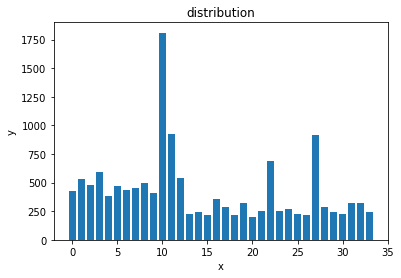

# 17b-yanzhengbin-2015
## 作业任务：
## Fashion-mnist 数据集：
1. 下载fashion—mnist数据集
1. 将fashion—mnsit数据集转换成TFRecord文件
1. 实现KNN算法
1. 实现K-means算法
1. 实现神经网络对样本进行分类
## 车牌字符识别：
### 数据分布：

### 训练集和验证集：
生成TFrecord文件：根据文件目录顺序读取(利用os.listdir()函数)其中80%用于生成训练集，20%生成验证集。 
根据函数sklearn.utils.shuffle()函数进行乱序 
### 网络结构：
第一层为输入层：输入的图片大小为：48x24
第二层为卷积层：卷积的参数是：5x5,步长为：1x1
第三层为池化层：池化的参数为：2x2,步长为：2x2
第四层为卷积层：卷积的参数是：5x5,步长为：1x1
第五层为池化层：池化的参数是：2x2,步长为：2x2
第六层为全连接层：输入维度为：64,输出维度为：1024
第七层为全连接层：输入维度为：1024,输出维度为：34
### 优化：
Adam优化器，学习率为：1e-4
keep_prob:0.5,防止过拟合
### 正确率：
字母 + 数字：98.0704

