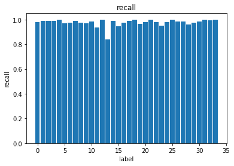

# 17b-yanzhengbin-2015
## 作业任务：
## 任务一：Fashion-mnist 数据集
### 步骤：
1. 下载fashion—mnist数据集
1. 将fashion—mnsit数据集转换成TFRecord文件
1. 实现KNN算法
1. 实现K-means算法
1. 实现神经网络对样本进行分类
### TFRecord的生成：
通过函数 tf.python_io.TFRecordWriter() 创建一个writer对象，读取下载好的mnist数据集中的图片和图片信息，写入TFRecord文件
### KNN算法对图片进行分类
通过求解input和已知标记的图片的距离，将其分类。正确率：

| 算法          | Accuracy      |
| ------------- |:-------------:|
| KNN           | 78.5%         |

### K-means算法：
对图片进行聚类，是一种无监督学习。
### NN
CNN(卷积神经网络)是特别适合用来分类图像的一种神经网络。 
通过卷积核池化，得到图片的特征图，减少网络的参数。通过Adam优化器训练数据。 
正确率：

| address       | Accuracy      |
| ------------- |:-------------:|
| train         | 93%           |
| test          | 90.5%         |
|validation     | 92%           |

## 任务二：车牌字符识别
### 数据分布：

### 训练集和验证集：
生成TFrecord文件：根据文件目录顺序读取(利用os.listdir()函数)其中80%用于生成训练集，20%生成验证集。 
数据集的随机程度越好，训练的效果越好，所以尽可能的生成乱序的TFRecord格式。通过两个空列表同时记录图片和标签的信息，通过函数np.hstack()连接，再根据函数sklearn.utils.shuffle()函数进行乱序，这样原来分类好的图片写入TFrecord时是乱序的，有利于神经网络的训练. 
如果加上shuffle_batch()函数，数据乱序程度会更加明显。
### 网络结构：
第一层为输入层：输入的图片大小为：48x24，输入层首先将一维图片转换成48x24x1 格式的图片 
第二层为卷积层：卷积的参数是：5x5,步长为：1x1。输出维度为：32。经过卷积后，图片的大小为：44x20x32 
第三层为池化层：池化的参数为：2x2,步长为：2x2。池化后的图片大小为：22x10x32 
第四层为卷积层：卷积的参数是：5x5,步长为：1x1。输出维度为:64,卷积后的图片大小为：18x6x64 
第五层为池化层：池化的参数是：2x2,步长为：2x2。池化后的图片大小为：9x3x64 
第六层为全连接层：输入维度为：64,输出维度为：1024。输入参数是：9x3x64 
第七层为全连接层：输入维度为：1024,输出维度为：34-->34是指有34个类别 
### 优化：
Adam优化器，学习率为：1e-4 
keep_prob:0.5,防止过拟合
### 验证集的正确率：

| address       | Accuracy      |
| ------------- |:-------------:|
| 数字 + 字母    | 98.0704%      |

### 验证集的召回率：

### 测试集的正确率：

| address       | Accuracy      |
| ------------- |:-------------:|
| 数字 + 字母    | 93.4418601%   |

### 测试集的召回率：

